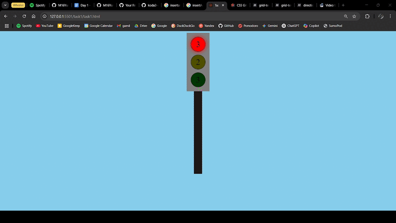

<details>
<summary> Details objective task nomor 1 (Click to expand!)  </summary>

```
membuat tampilan lampu lalu lintas dengan menggunakan HTML dan CSS
 a. Memberikan interaksi seperti lampu lalu lintas pada umumnya menggunakan JS 
   i. Diawali dengan lampu warna merah yang menyala
   ii. Setelah 3 detik matikan merah dan nyalakan kuning
   iii. Setelah 2 detik matikan kuning dan nyalakan hijau
   iv. Biarkan hijau menyala selama 3 detik, lalu kembali lagi menjadi merah
 b. Gunakan method dan property dari object element
```

</details>


### Demo answer for task no 1 



<details>
<summary> Details objective task nomor 2 (Click to expand!) </summary>

```
membuat papan catur dengan menggunakan dynamic element
a. Element langsung ditambahkan kedalam body
b. Diperbolehkan untuk memberikan styling sebagus mungkin
```

</details>

### Demo answer for task no 2


<details>
<summary>  Details objective task nomor 3 (Click to expand!) </summary>

```
Berdasarkan data berikut, buatlah:
```


```
a. Element div dengan kelas "Profile-card"
b. Tambahkan h2 dengan isi nama profil
c. Berikan paragraf yang berikan nama dan profesi (umur: 30, profesi: web Developer)
d. Buatlah hobi menggunakan list tidak berurut
e. Tambahkan elemen-elemen diatas ke dalam element div profile-card
f. Masukan elemen div profile-card ke dalam body
```

</details>


### Demo answer for task no 3


<details>
<summary>  Details objective task nomor 4 (Click to expand!) </summary>

```
Berdasarkan struktur tabel dibawah ini, ubahlah:
```


```
a. Tambahkan baris baru dengan nama charlie dan nilai 92
b. ubah nilai bob menjadi 89
c. Berikan kelas top-score pada baris dengan nama Alice
d.  Tambahkan baris tabel footer dengan isi average dan kalkulasikan nilai rata-ratanya
```

</details>


### Demo answer for task no 4


## Review result of minitask Week 4 day 1

<details>
<summary>  Details result review (Click to expand!) </summary>

### result review task number 2


### result review task number 3


### result review task number 4


</details>